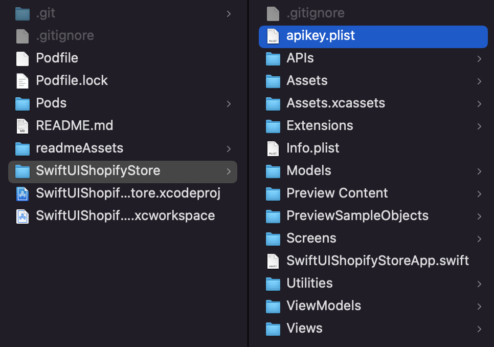

[![Swift Version][swift-image]][swift-url]
[![Build Status][travis-image]][travis-url]
[![License][license-image]][license-url]
[](https://github.com/Carthage/Carthage)
[](https://img.shields.io/cocoapods/v/LFAlertController.svg)
[](http://cocoapods.org/pods/LFAlertController)
[](http://makeapullrequest.com)

# SwiftUI + GraphQL Shopify Online Store
<!-- <br />
<p align="center">
  <a href="https://github.com/alexanderritik/Best-README-Template">
    
  </a>
  <p align="center">
    One to two paragraph statement about your product and what it does.
  </p>
</p> -->

<!-- <p align="row">


</p> -->

## Features

<dl>
<li>Fetching product information by using GraphQL</li>
<li>Asynchronous UI update. Fetch products info by GraphQL then update UI</li>
<li>CocoaPods</li>
<li>Shopify iOS Buy SDK</li>
</dl>

## Requirements

- iOS 13.0+
- Xcode 13

## Installation

### CocoaPods
You can use [CocoaPods](http://cocoapods.org/) to install `Shopify iOS SDK`. Please run following command to install:

```ruby
pod install
```

### Shopify Api Key
To connect to Shopify backend, you need to place "apikey.plist" in "SwiftUIShopifyStore" directory.



[swift-image]:https://img.shields.io/badge/swift-3.0-orange.svg
[swift-url]: https://swift.org/
[license-image]: https://img.shields.io/badge/License-MIT-blue.svg
[license-url]: LICENSE
[travis-image]: https://img.shields.io/travis/dbader/node-datadog-metrics/master.svg?style=flat-square
[travis-url]: https://travis-ci.org/dbader/node-datadog-metrics
[codebeat-image]: https://codebeat.co/badges/c19b47ea-2f9d-45df-8458-b2d952fe9dad
[codebeat-url]: https://codebeat.co/projects/github-com-vsouza-awesomeios-com
